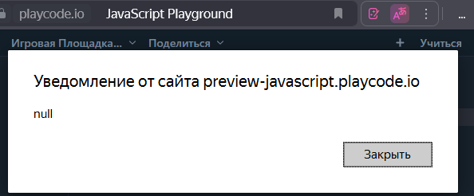
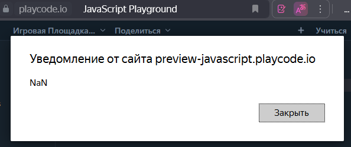
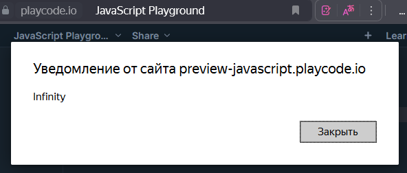
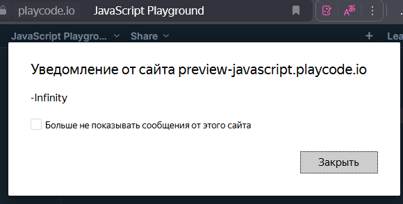
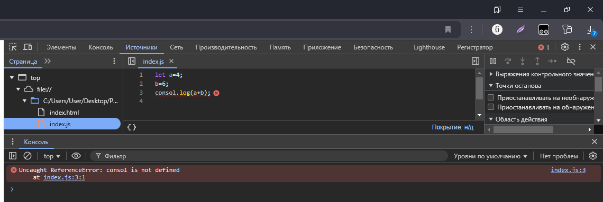
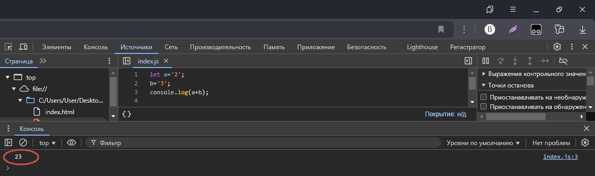
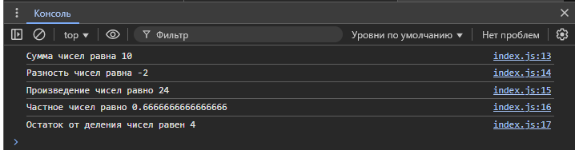

# Homework_09.04
### Задание 1
1. Создать новый файл lesson2.html
2. Создать переменную и спросить у пользователя “Ваш
возраст”
3. Вывести на экран текст. Вам “возраст пользователя” лет
4. Спросить у пользователя его имя
5. Вывести на экран, Добро пожаловать на сайт “Имя
пользователя”
####  Результат вывода программы в папке picture --> задание1
### Коментарии к заданию 2
1. программа выведет в консоль число 3
```
let a=13;
b=5;
console.log(a%b);
```
2. в переменную не было вложено значение, поэтому программа выведет null

3. будет выведено NaN(Not a Number), так как строку нельзя умножить на число

4. вызов ```alert(1/0)``` выведет Infinity(бесконечность), а ```alert(-1/0)``` выведет -Infinity, так как отрицательное число, деленное на ноль, дает отрицательную бесконечность.<br>
<br>

5. вызов ```alert('2' * '3')``` выведет значение 6, так как строки будут приведены к числам перед выполнением операции умножения
### Задание 3
1. после совершения ошибки в коде консоль вывела ошибку и указала в какой строке она находится и какая команда не правильно написана

2. из-за того, что переменные a и b являются строками JavaScript выполняет конкатенацию (слияние) строк вместо арифметического сложения.

3. результат вывода консоли. Файл с кодом index.html и index.js

